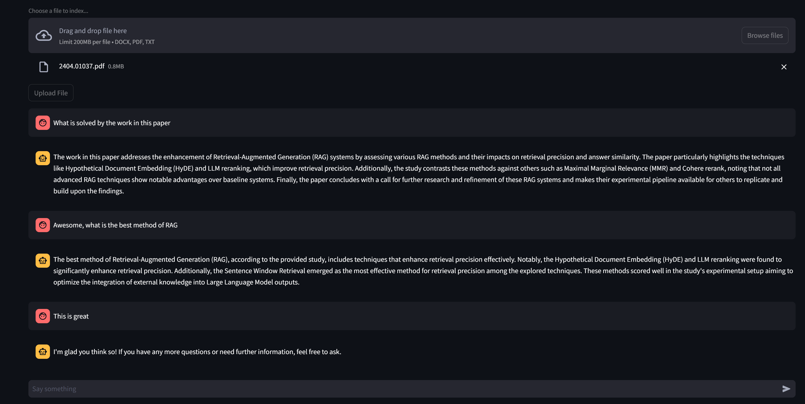

# RAG Agent: Document Assistant 🚀🤖

This project has evolved from a simple PDF chatbot to a sophisticated RAG (Retrieval-Augmented Generation) agent capable of accessing conversation history, retrieving context, summarizing documents, and answering follow-up questions based on user queries and intent detection. 

## Installation

To set up this project, you'll first need your OPENAI_API key. Next, ensure you have the necessary dependencies installed. You can install them via:

`pip install -r requirements.txt`

## Usage

To launch the RAG agent, run the command:

`python -m streamlit run agentic_rag.py`

This will start the Streamlit app in your browser. Once launched, you can upload your PDFs or DOCx and start querying naturally for summaries, in depth queries, and follow up questions!

## Features

- **Conversation History**: The RAG agent can access conversation history to maintain context and provide more relevant responses.
- **Document Summarization**: It can summarize documents to provide concise answers or overviews.
- **Follow-up Answers**: The agent can answer follow-up questions based on previous interactions and the current conversation context.
- **Logical Intent Determination**: It uses logic to determine user intent, ensuring accurate responses.
- **PDF Selection**: Users can upload and select PDF/DOCX manuals directly within the app interface.

## History

This project is an ongoing effort to enhance the capabilities of the RAG agent. While the functionality is currently demonstrated in the provided .py file, further developments are in progress. Stay tuned for updates as I transition this project into a fully functional application that enables local execution and PDF selection through a user-friendly interface.

## Credits

Your's truly 😅

## License

Apache2.0

Enjoy interacting with your documents through this intelligent RAG Agent!

